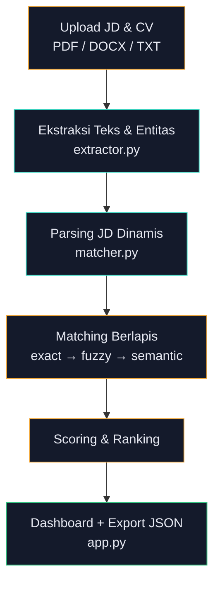

# 🛰️ CV Screening Console

**Solusi AI/ML untuk mengotomatisasi proses seleksi CV** — dari ekstraksi informasi, pencocokan kualifikasi terhadap Job Description, hingga rekomendasi kandidat siap wawancara. Dibangun sebagai Proof of Concept untuk Technical Assessment posisi AI Specialist.


---

## ✨ Fitur Utama

- **Multi-format ingestion** — mendukung upload CV & JD dalam format PDF, DOCX, dan TXT
- **Ekstraksi informasi otomatis** — nama kandidat, skill, pendidikan, dan pengalaman kerja diekstrak langsung dari teks dokumen
- **Requirement dinamis dari JD** — kriteria required & preferred skill ditarik langsung dari teks Job Description, **bukan** dari kamus skill yang di-hardcode ke satu industri — sehingga bisa dipakai untuk posisi apa pun (AI/ML, HR, Sales, Finance, dst.)
- **Layered matching strategy** — exact match → alias/sinonim terkurasi → fuzzy (typo-tolerant) match → semantic embedding fallback
- **Semantic similarity** — menggunakan `sentence-transformers` (`all-MiniLM-L6-v2`) untuk menangkap kecocokan makna, bukan hanya kata yang sama persis
- **Scoring tertimbang & transparan** — setiap kandidat mendapat skor 0–100 lengkap dengan breakdown per kriteria, evidence (kutipan CV), dan alasan rekomendasi
- **Dashboard interaktif** — UI "Scan Console" bertema dark, menampilkan ranking kandidat, skor gauge, dan detail matched/missing requirements
- **Export hasil** — seluruh hasil screening dapat diunduh dalam format JSON untuk keperluan audit atau integrasi lebih lanjut

---

## 🧠 Metodologi Scoring

Skor akhir dihitung dari lima komponen dengan bobot berikut:

| Komponen | Bobot |
|---|---|
| Required Skills | 35% |
| Experience | 25% |
| Education | 15% |
| Semantic Similarity | 15% |
| Preferred Skills | 10% |

**Ambang rekomendasi:**
- 🟢 **SHORTLIST** — skor ≥ 75 **dan** seluruh mandatory requirement terpenuhi
- 🟡 **REVIEW** — skor 60–74, layak ditinjau manual oleh HR
- 🔴 **REJECT** — skor < 60 atau mandatory requirement belum terpenuhi

---

## 🏗️ Arsitektur


---

## 🚀 Instalasi & Menjalankan

### 1. Clone repository
```bash
git clone https://github.com/Adipurnama7/cv-screening-console.git
cd cv-screening-console
```

### 2. Buat virtual environment (opsional, disarankan)
```bash
python -m venv venv
source venv/bin/activate   # Windows: venv\Scripts\activate
```

### 3. Install dependencies
```bash
pip install -r requirements.txt
```

### 4. Jalankan aplikasi
```bash
streamlit run app.py
```

Aplikasi akan terbuka otomatis di `http://localhost:8501`.

## ⚖️ Etika & Mitigasi Bias

Desain sistem ini secara sengaja menghindari beberapa risiko bias umum pada tools screening otomatis:

 **Tanpa atribut sensitif** — nama, foto, gender, usia, dan afiliasi tidak pernah dijadikan fitur penilaian
 **Transparan & bisa diaudit** — setiap skor disertai evidence dan reasons yang bisa ditelusuri ke teks asli CV
 **Human-in-the-loop** — output sistem adalah rekomendasi berjenjang (Shortlist/Review/Reject), bukan keputusan final
**Requirement dinamis per-JD** — mengurangi risiko bias struktural terhadap kandidat dari latar belakang non-konvensional
**Jejak audit** — seluruh hasil dapat diekspor untuk keperluan compliance atau audit bias di kemudian hari

---

## 🗺️ Roadmap

- [ ] Integrasi ingest CV otomatis via API job portal resmi / email inbox parsing / webhook ATS
- [ ] Containerization untuk pemrosesan paralel skala besar
- [ ] Database riwayat kandidat + role-based access untuk tim HR
- [ ] Monitoring kualitas skor & audit bias berkala pasca-deploy

---

## 🛠️ Tech Stack

- **Frontend/Dashboard:** Streamlit
- **NLP/ML:** sentence-transformers, scikit-learn (cosine similarity)
- **Document Parsing:** PyMuPDF (`fitz`), python-docx
- **Matching:** regex-based extraction, difflib (fuzzy matching), semantic embeddings

---

## 👤 Kontak

**Adi Purnama**
- Email: [adipurnamaa4@gmail.com](mailto:adipurnamaa4@gmail.com)
- GitHub: [github.com/Adipurnama7](https://github.com/Adipurnama7)
- LinkedIn: [linkedin.com/in/adi-purnama-83674b278](https://linkedin.com/in/adi-purnama-83674b278)
- Portfolio: [adipurnama7.github.io/portopolio](https://adipurnama7.github.io/portopolio)
- Live Demo: [AI CV Screening POC](https://adipurnama7-ai-cv-screening-poc-app-txljx9.streamlit.app/)
---

## 📄 Lisensi

Proyek ini dibuat sebagai Proof of Concept untuk keperluan Technical Assessment.